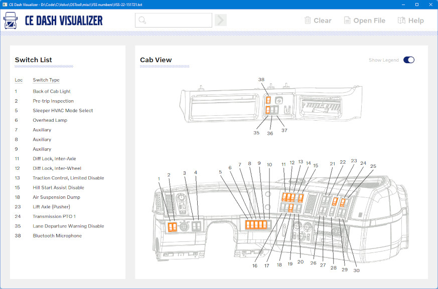

# CE Dash Visualizer

## Overview
This application displays a visualization of a truck dash as configured by a specification, designated with a 'VSS' number. The VSS number is generated at time of quotation. The application will download a spec with a given VSS number or use a spec contained in a file. The options present in the spec determine what switch locations are occupied and panels are used.

## Features
* Displays occupied switch locations
* Listed switches are selectable; clicking on a listed item draws a rectangle around the corresponding switch to highlight its position
* A legend (which can be toggled on or off) displays switch location numbers
* Warns the user if a spec is constructed improperly (i.e., two switches in the same location)
* Keyboard shortcuts for all functions
* Downloads a spec with a given valid VSS number, or uses a spec stored in a text file

## Motivation
When formalizing a price quote for a custom setup, the dash configuration needs to be analyzed to identify conflicts, ensure adequate wiring harness lengths, and identify open locations for additional components. Traditionally, this has been performed by hand - checking multiple combinations of options on a giant spreadsheet that call out components in every switch location. This approach is tedious and error prone. This application aims to enhance productivity and accuracy in the quoting process by automating this task.

## Build Instructions
Clone the repository and open the solution file (OSTool.sln) in Visual Studio 2022. From the main menu, select Build -> Build Solution. Use Debug -> Start Without Debugging to run the application.

## Testing the Application
Downloading the spec will not work without being connected to the private intranet. To test the application, there are specification files provided in a subdirectory named 'VSS Numbers'. Use the 'Open File' button at the top of the application to with these files.